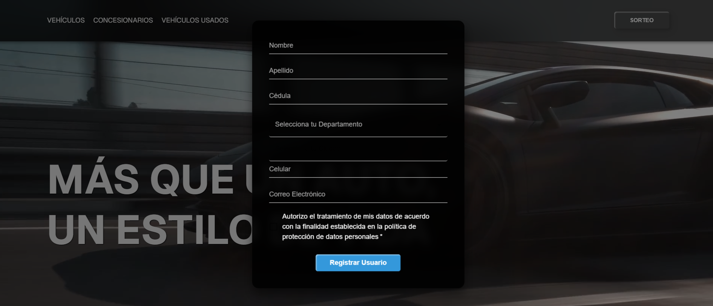

# Car company landing page
## Tabla de Contenidos
* [Descripción](#descripción)
* [URL pública](#url-pública)
* [App](#app)
* [Tecnologías](#tecnologías)
* [Setup](#setup)

---

## Descripción
Este proyecto es una aplicación web de una compañía de autos, para la recolección de datos de sus usuarios mediante el registro de los mismos en un sorteo. La aplicación permite a los usuarios registrarse, consultar su código de participación y revisar los detalles del evento. La aplicación se despliega en Firebase y está diseñada para ofrecer una experiencia de usuario ágil y optimizada para dispositivos móviles y de escritorio.

### Objetivo
El objetivo principal de la aplicación es ofrecer una interfaz intuitiva para que los usuarios puedan participar en un sorteo de forma sencilla y rápida. Además, se enfoca en asegurar una experiencia de usuario fluida desde el registro hasta la consulta de su código de participación, mejorando la accesibilidad y el rendimiento.

### Criterios

En el documento de prueba se especificaron características funcionales que debía tener la aplicación pero se basaban mas que todo en criterios de validación de datos en el formulario de registro de los usuarios, se especificó que no era de importancia el diseño pero se tendría en cuenta como un plus.

### Desarrollo

La aplicación la desarrollé con el framwork Next.js con un enfoque en componentes reutilizables y modales para una interacción dinámica. Para un eficiente despliegue dado el tiempo de desarrollo, decidí hacer uso de Firebase para tener el servicio de hosting de la aplicación y además poder incluír otras funcionalidades extras aprovechando su base de datos (Firestore).

La gestión de estado y validaciones se realizan en React, asegurando una experiencia de usuario consistente y sin fricciones.

Como base desarrollé las funcionalidades requeridas en el formulario de registro de usuarios.
Consumí APIs para obtener los listados de departamentos y municipios para los campos correspondientes en el formulario.
Realicé validaciones de tipo y extensión en los distintos campos como documento, nombres y correo.

### Funcionalidades Plus

* Registro de Usuario: Además de las validaciones antes mencionadas, en el formulario de inscripción se está consultando la base de datos para que cada usuario esté registrado una única vez; de esta manera, un usuario tiene un único código para el sorteo.
Ésto es claro para el usuario ya que se le avisa si ya está inscrito.

* Consulta de Código: La aplicación permite a los usuarios verificar su participación consultando su registro en el sorteo mediante su numero de documento, sin necesidad de recargar la página. De igual manera se le avisa al usuario si aún no está registrado.

* Responsive: El diseño es un plus en la aplicación ya que se adapta correctamente a diferentes dispositivos.

* Despliegue en Firebase: La aplicación utiliza Firebase para hosting, y base de datos, aprovechando su infraestructura escalable.

### Posibles mejoras.

Optimización del rendimiento: Mejoras en la carga de algunas imágenes y el manejo de eventos en componentes de alta interacción.
Ampliación de funcionalidad: Agregar la posibilidad de notificar a los usuarios sobre los resultados del sorteo o próximos eventos.
Ampliación de contenido: Agregar más contenido a la aplicación aprovechando su modularidad.

---

## URL Pública
Auí está desplegada la app : https://car-app-8ce47.web.app/

---

## App





---

## Tecnologías
Este proyecto fue desarrollado utilizando las siguientes tecnologías:

* Next.js
* React
* API
* MaterialUI
* JavaScript
* HTML
* CSS
* Firebase (DB, firestore, hosting)
* Git & github

---

## Setup
Para correr este proyecto, después de clonar mi repositorio, inslalo localmente usando npm:

```
$ cd car-landing-page
$ npm install
$ npm run dev
```
---
Gracias por tu visita.

## Author
* **Martin Corredor** - [martincorredor](https://github.com/martincorredor)

## [License]

MIT © [Martin Corredor](https://github.com/martincorredor)